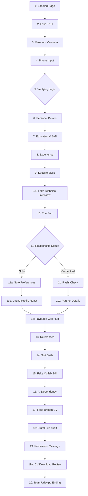

# Thangappan Prank Application Structure

This project is a single-page application (SPA) built using Vanilla HTML, CSS, and JavaScript. It serves as a continuous 20-stage interactive psychological prank disguised as a deceptive CV builder.

## 📂 File Structure

```text
c:\Users\Admin\Desktop\prank\
├── index.html                 # Core Game File: contains all CSS styles, HTML page containers, and Vanilla JS logic.
├── server.js                  # A simple Node.js server (likely Express) to serve the game locally.
├── generate_audio.js          # Utility script to generate or map audio files.
├── thangappan_workflow_v4.md  # The game design document and technical specifications.
├── build_update.ps1           # Build/development script.
└── Assets                     # Audio files (e.g., ponnappan.mp3) and Images (e.g., Thangappan1.jpeg).
```

## 🏗️ Architecture

The app is built on a simple state-machine architectural pattern:

- **State Management**: A global `user` object stores all inputs (name, city, BMI, skills, etc.).
- **View Controller**: The `goPage(n)` function handles page transitions, hiding the current `.page` and showing the next `.page`.
- **Initialization Hooks**: Each page can implement an `initPageN()` function. When `goPage(n)` is called, the system automatically checks for and executes `window['initPage' + n]` to trigger page-specific animations, audio, and logic.
- **Audio System**: A centralized `playAudio(slotId)` function manages triggering sequential audio tracks synced with the page states.
- **Styling**: All styling is encapsulated inside `index.html` via a defined CSS tokens variable system (e.g., `--forest`, `--saffron`, `--gold`).

## 🗺️ Page Workflow

The sequence forces the user through escalating psychological stress and absurdity, ultimately culminating in a life audit.



## 🎭 Notable Prank Mechanics

1. **Name Lock (Page 6)**: The user's input name is deliberately mangled, preventing them from fixing it for the rest of the flow.
2. **BMI Roast (Page 7)**: Automatically calculates BMI based on height/weight and uses it for subsequent tailored roasts.
3. **The Fake Interview (Page 9.5)**: The most complex sequence. Requests camera access, fakes a video call, drops a fake low battery notification, displays a fake network warning, simulates an HR freeze, and ultimately sends a fake bank debit DOM notification.
4. **Fake Collaborative Edit (Page 15)**: When the user starts typing, a simulated external cursor ("Thangappan") actively overwrites their input.
5. **The Color Lie (Page 12)**: Asks for a favorite color, flashes the absolute inverse color, and prompts the user to blindly agree to it.
6. **The Life Audit (Page 18)**: Instead of the CV, dynamically feeds back all their choices compiled into an overly personal analysis of their life.
